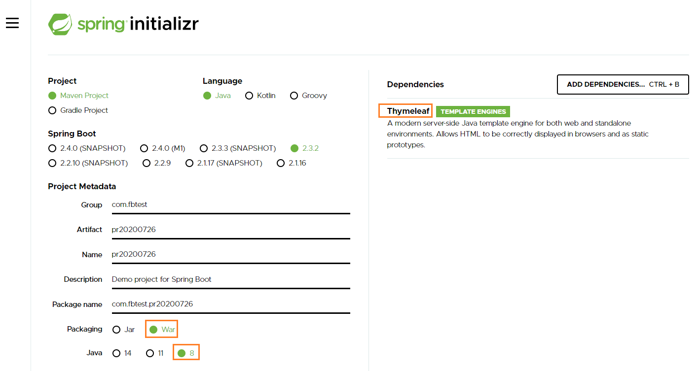
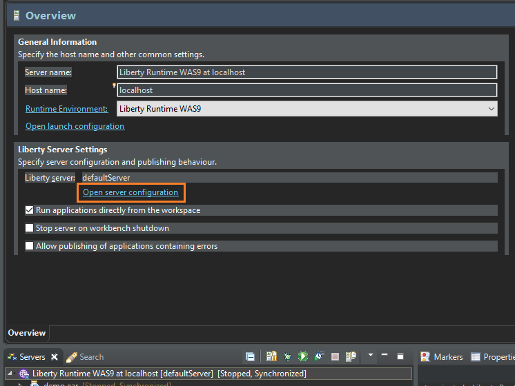

# Practice of Spring-boot and AngularJS

## Created
	- https://start.spring.io/
	
 

## Reference

### video 
	- https://learning.oreilly.com/videos/spring-mvc-for/9781492036043/9781492036043-video319678

### Common Application properties
	- https://docs.spring.io/spring-boot/docs/current/reference/html/appendix-application-properties.html
	
### Building an Application with Spring Boot
	- https://spring.io/guides/gs/spring-boot/
	
### Consuming a RESTful Web Service with AngularJS
	- https://spring.io/guides/gs/consuming-rest-angularjs/
	
### Tutorial: Using Thymeleaf	
	- https://www.thymeleaf.org/doc/tutorials/2.1/usingthymeleaf.html#script-inlining-javascript-and-dart
	
### Spring MVC and Thymeleaf: how to access data from templates
	- https://www.thymeleaf.org/doc/articles/springmvcaccessdata.html	
	
	
## Note

### invokeFlushAfterService="false"
	

	
	- click "open server configuration" to open server.xml
	
	- Add: <webContainer throwExceptionWhenUnableToCompleteOrDispatch="false" invokeFlushAfterService="false"></webContainer>